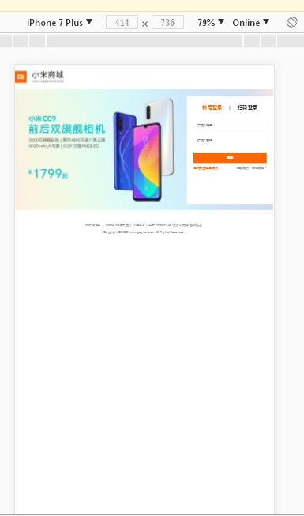
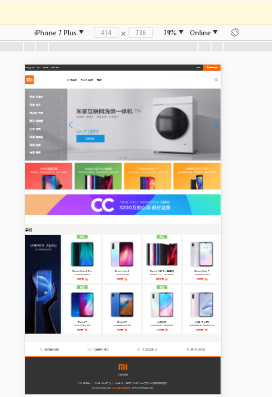
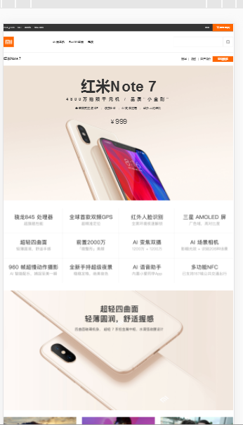
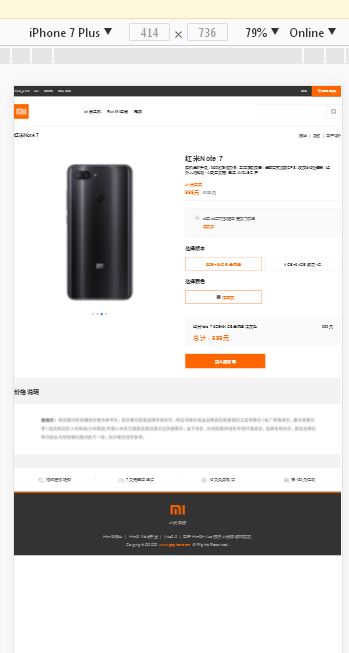
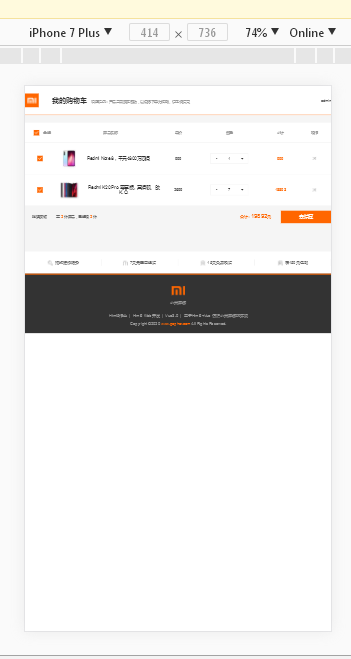
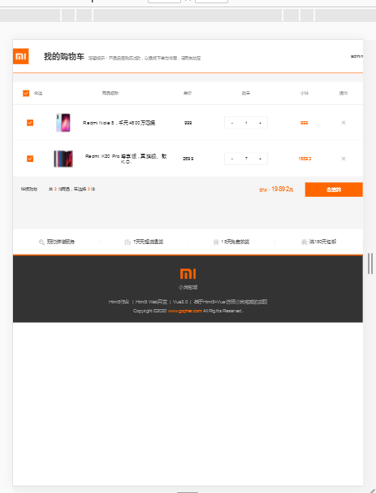
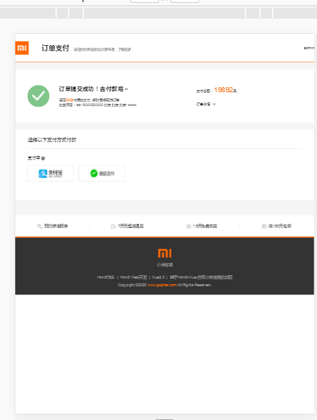

# Html5_Work
> 基于Html5+CSS3+JS+Vue全家桶实现仿小米商城的 web系统

## 技术要点:

1. 基于Vue3.0构建整体项目
2. 使用vue-router作为单页SPA应用路由
3. 使用axios发送网络请求
4. 使用vuex作为状态管理
5. 弹出层提示使用element-ui组件美化
6. 使用easy-mock进行网络请求数据模拟

## 项目启动:

1. 本地安装好node、npm、vue3
2. cd Html_Work && npm install && npm run serve
3. 项目启动地址:http://localhost:8080/#/index
4. 默认登录的用户名和密码是 admin、admin

## 项目功能:
> 本项目是仿照小米商城官网所做的仿站,包括用户登录、注册、首页展示、商品列表展示、商品详情展示、添加购物车、支付、拉取订单等功能

